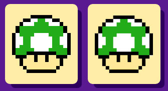

#How to play

The object of the game is to **match** any **2** cards.

Use the cursor to choose any 2 cards by clicking them. Did they match? Great! Keep going until all the cards have been revealed.

If the two cards you chose didn't match, don't worry, just try your best to remember which items were revealed, and where they were positioned on the board.
Once a mismatched pair has been chosen, they will quickly flip back over, so pay attention and try again!

